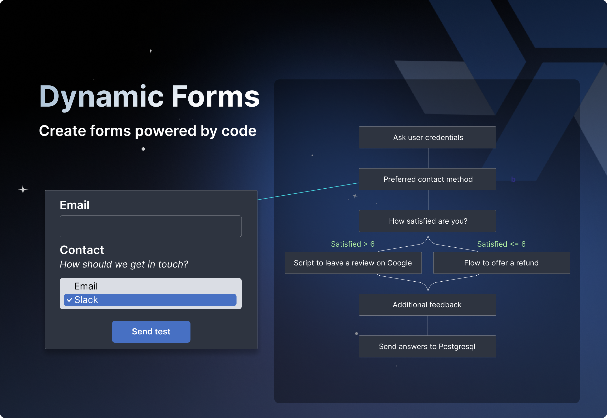

Create your own TypeForm-like dynamic form and embed scripts & flows.



Dynamic forms are essential tools to allow users to interactively input data in a way that adapts to their specific needs. Unlike static forms, dynamic forms can change in real-time based on user input. With code, you could even go forward and trigger actions from the form (send email, ask for refund, get more information).

Windmill's [Decision tree](/docs/apps/app_configuration_settings/decision_tree) component allows to define a flow-like structure with frames ordered by conditions. Each node in the tree represents a decision point and can lead to one or more subsequent nodes based on specified conditions.

By combining it with other components such as the [form](/docs/apps/app_configuration_settings/form_input) component or [buttons](/docs/apps/app_configuration_settings/button), it is possible to create a completely customized dynamic form yourself, with the incorporation of [scripts](/docs/script_editor) and [flows](/docs/flows/flow_editor) to trigger powerful actions.

## Tutorial

The tutorial video below shows the creation of a dynamic form collecting consumer feedback, sending a message on [Slack](https://hub.windmill.dev/scripts/slack/1432/send-direct-message-slack) or [Gmail](https://hub.windmill.dev/scripts/gmail/1291/-send-email-gmail), before [storing the responses](#insert-row-to-supabase) in a PostgreSQL table in Supabase.

<iframe
	style={{ aspectRatio: '16/9' }}
	src="https://www.youtube.com/embed/MTGZTO1AduM?vq=hd1080"
	title="Dynamic Form Tutorial"
	frameBorder="0"
	allow="accelerometer; autoplay; clipboard-write; encrypted-media; gyroscope; picture-in-picture; web-share"
	allowFullScreen
	className="border-2 rounded-lg object-cover w-full dark:border-gray-800"
></iframe>

<br/>

## Code used

### App and decision tree

The app can be found on [WindmillHub](https://hub.windmill.dev/apps/21/dynamic-form-example).

### Insert row to Supabase

Script wrote with [WindmillAI](/docs/core_concepts/ai_generation):

```ts
import { createClient } from "npm:@supabase/supabase-js";

// Define the Supabase resource type as specified
type Supabase = {
  key: string;
  url: string;
};

export async function main(
  supabaseResource: Supabase,
  tableName: string,
  rowData: Record<string, any>,
) {
  // Initialize the Supabase client
  const supabase = createClient(supabaseResource.url, supabaseResource.key);

  // Insert a row into the specified table
  const { data, error } = await supabase
    .from(tableName)
    .insert([rowData]);

  // Return the result or throw an error if the operation failed
  if (error) {
    throw error;
  }

  return data;
}
```

with `rowData` =

```
{
  "name": b.values.first_name,
  "city": b.values.City,
  "email": c.values.Email,
  "contact": c.values.Contact,
  "rating": f.result,
  "feedback": bg_0.result
}
```

### Flow to send Slack or Email to user based on their choice

The flow can be found on [WindmillHub](https://hub.windmill.dev/flows/52/send-slack-or-email-to-user-based-on-their-choice).

### Return feedback from both form components (positive and negative) into a single string

Script wrote with [WindmillAI](/docs/core_concepts/ai_generation):

```py
from typing import Optional, TypedDict


# Define the main function with optional parameters 'positive' and 'negative'
def main(positive: Optional[str] = None, negative: Optional[str] = None) -> str:
    # Check if both 'positive' and 'negative' are provided
    if positive and negative:
        return f"{positive}.{negative}"
    # Return 'positive' if only 'positive' is provided
    elif positive:
        return positive
    # Return 'negative' if only 'negative' is provided
    elif negative:
        return negative
    # Return an empty string if neither is provided
    else:
        return ""
```