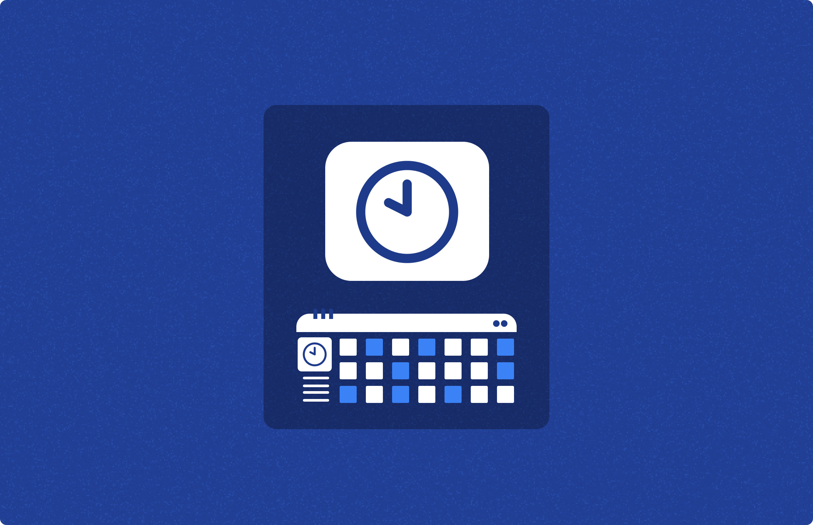
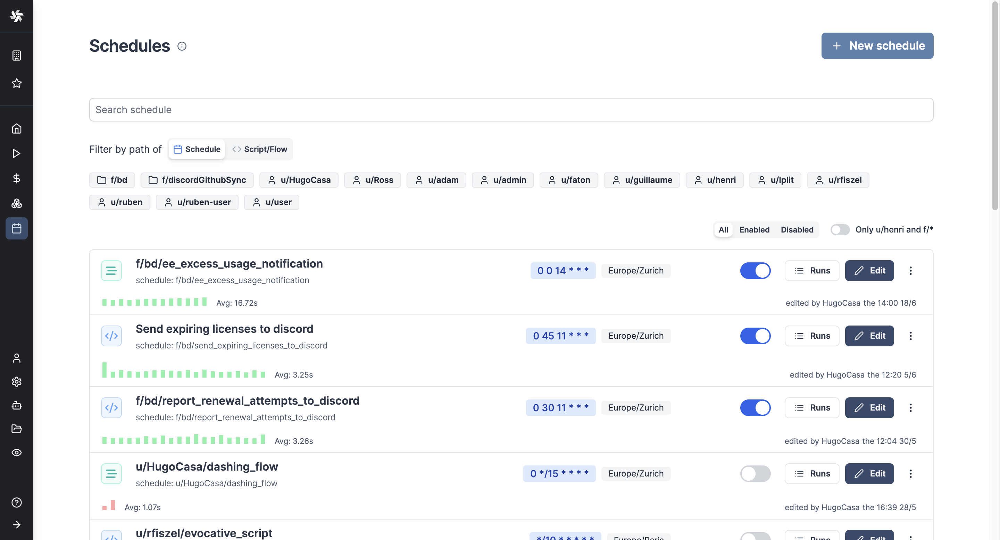
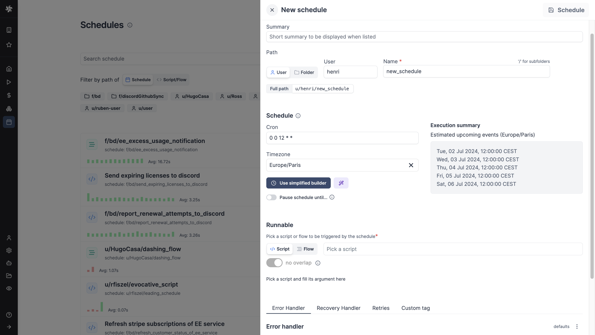
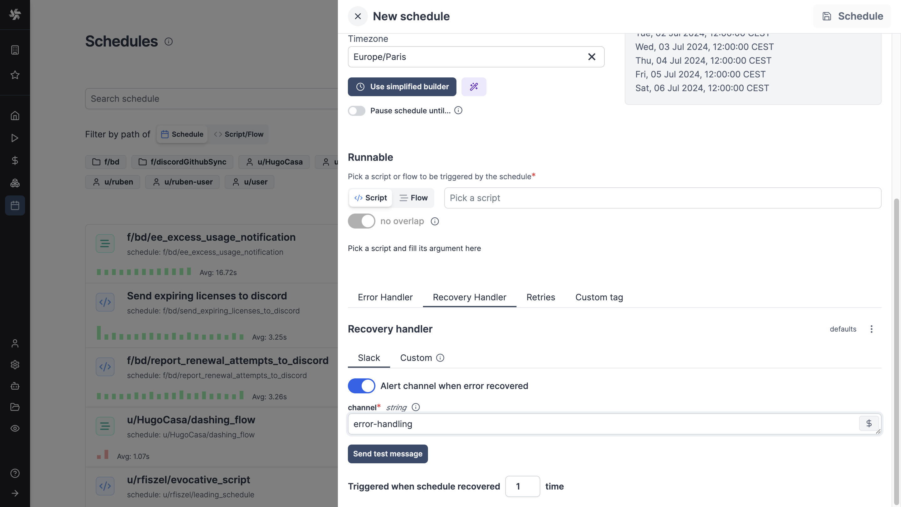

# How to Edit Crontab: Examples



Crontabs (cron table) are tools on Unix-like systems that automate tasks by scheduling scripts and commands to run at specified times using the [cron](https://en.wikipedia.org/wiki/Cron) daemon.

This guide aims to explain the concept of crontabs, explore various methods for editing them, and highlight strategies to circumvent typical challenges encountered in crontab management.

## Cron Jobs

[Cron](https://en.wikipedia.org/wiki/Cron), available on Unix and similar operating systems, is a scheduling utility that performs tasks at set intervals—hourly, daily, weekly, etc. It leverages a cron daemon to automate such tasks, which are incredibly versatile in their applications. For instance, cron jobs are ideal for tasks like sending regular emails, conducting system health checks, performing database backups, or syncing data across systems. They are customizable to precise frequencies, such as every minute or on particular days of the week.

## What is a Crontab?

A crontab is essentially a configuration file that dictates the schedule of tasks executed by the cron utility. It allows users to define sophisticated schedules like "4pm every second Wednesday of the month." For example, to dispatch a weekly reminder every Monday at 9 AM, one would use the following entry in a crontab:

`0 9 * * 1 /usr/bin/send-reminder.sh`

Specifying the full PATH to applications, commands, or scripts in crontab is crucial as the cron environment does not necessarily have the same PATH environment variable as the user's interactive shell. This can lead to commands failing to execute if their locations are not explicitly defined. By including the full PATH, you ensure that the correct command executes as intended, regardless of the environment from which cron is running.

## Crontab Format

Understanding the crontab format is crucial. Referencing the reminder example:

| Entry from example | Name             | Accepted values | Explanation                                                        |
|--------------------|------------------|-----------------|--------------------------------------------------------------------|
| 0                  | minute           | 0-59            | Specifies the minute within the hour, from 0 to 59.                |
| 9                  | hour             | 0-23            | Specifies the hour of the day, using a 24-hour clock from 0 to 23. |
| *                  | day of month     | 1-31            | Indicates any day of the month can be selected for the task.       |
| *                  | month            | 1-12            | Allows the task to run in any month, January (1) through December (12). |
| 1                  | day of week      | 0-9             | Specifies the task to run on Monday (1), with Sunday as 0 or 9.    |
| /usr/bin/send-reminder.sh | (script) | N/A             | Executes the `send-reminder.sh` script located in `/usr/bin`.    |

Crontabs can also be shown as:

```
# * * * * * command to be executed
# | | | | |
# | | | | |
# | | | | |
# | | | | |_______________ Day of the Week (0 - 6)(Sunday to Saturday)
# | | | |
# | | | |_______________ Month of the Year (1 - 12)
# | | |   
# | | |_______________ Day of the Month (1 - 31)
# | |
# | |_______________ Hour (0 - 23)
# | 
# |_______________ Minute (0 - 59)
```

Each user on a system, including the root user, can have their own crontab.

## Editing Crontabs

### Using `crontab -e`

The standard method for modifying a crontab is via the `crontab -e` command, which opens the crontab in the default editor. For instance, to change the reminder schedule from Monday to Tuesday:

- View the current crontab with `crontab -l`.
- Open it for editing with `crontab -e`.
- Change the day of the week from `1` (Monday) to `2` (Tuesday).

This method ensures that only syntactically correct modifications are saved, preventing potential errors.

### Direct Editing (Not Recommended)

Although you can find crontab files under `/var/spool/cron/crontabs/` and edit them directly, this approach is risky. Direct editing bypasses the safeguards provided by the `crontab -e` method, such as temporary file handling and syntax validation, and typically requires administrative privileges.

## Removing  crontab file

To remove the current crontab file, just run the crontab command:

```
crontab -r
```

and press enter.

## Editing another user's crontab file

To edit another user's crontab file - and if you have admin privileges - run crontab command:

```
crontab -u <username>
```

and press enter.

## Why Editing Crontabs is Hazardous

Crontab management often presents challenges, such as cron daemon errors or permissions issues, which can prevent tasks from executing as expected.

### Cron Daemon Failures

Cron daemons can fail due to resource limitations. Log files, often stored in `/var/log/syslog` or `/var/log/cron`, are critical for diagnosing these failures but can be challenging to analyze due to their transient nature.

### Permission Discrepancies

Crontab manages permissions primarily through user-specific crontab files, allowing users to schedule tasks with their own permissions. A system-wide crontab also exists, which requires specifying a user for each task and is typically editable only by system administrators. The root user can schedule tasks that can affect the entire system through their own crontab. Access to crontab can be controlled using `/etc/cron.allow` and `/etc/cron.deny` files, which specify which users can or cannot create or edit crontabs. Scripts run by cron must be properly secured to prevent unauthorized system modifications.

Tasks may fail if they require permissions not granted to the scheduling user. This discrepancy often requires thorough log reviews to identify and resolve.

### Monitoring

To ensure a cron job is functioning as expected, users should not forget log the following: the date and time of each job's execution, the exit status or error codes, any output or error messages, and the job identification details. Including system performance metrics like CPU and memory usage during execution can also be useful. This data aids in troubleshooting and understanding the job's impact on system performance.

### Environment Variable Misconfigurations

Cron jobs that depend on specific environment settings can fail if these are not correctly defined. Proper management involves setting these variables in user-specific profiles or system-wide configuration files.

To set up environment variables in a crontab, you can define them directly at the top of the crontab file, ensuring they apply to all jobs listed below them. For instance, setting PATH or HOME ensures that scripts execute with the correct directory references and available commands. Alternatively, you can specify environment variables on a per-job basis by prefixing the cron job line with the variable declarations. This method allows different cron jobs to run under different environments. Remember to provide the full path for any application or command in your cron job to prevent execution errors due to path issues.

### Lack of Central Management

In environments with multiple crontab users, the absence of a unified management tool can complicate the visibility and coordination of scheduled tasks. A centralized scheduling tool or a managed team approach can alleviate these difficulties.

## Windmill Schedules

In Windmill, [schedules](/docs/core_concepts/scheduling) allow you to plan the regular execution of flows and scripts (from any [supported languages](/docs/getting_started/scripts_quickstart)). They are designed to provide similar functionality to cron, but with a more user-friendly interface and additional features.

A Windmill schedule consists of several key components :
   - Script or Flow: The task to be executed.
   - Arguments: The inputs required for the script or flow.
   - CRON expression: Defines the frequency of execution (a low-code helper or a prompt with [Windmill AI](/docs/core_concepts/ai_generation#cron-schedules-from-prompt) are available from Windmill).
   - Error Handler: Optional script to handle execution failures.
   - Recovery Handler: Optional script to handle recovery from errors.



### Creating a Schedule

You can create a schedule from Windmill UI within Scrit or Flow editors, or from the dedicated Schedules menu.

Windmill allows you to create multiple schedules for the same workflow, enabling parallel execution of tasks with different frequencies.

Schedules can also be created with [Windmill API](https://app.windmill.dev/openapi.html#model/newschedule).



### Monitoring and Control

Windmill provides a centralized hub for navigating and monitoring scheduled jobs. All past & future scheduled runs can also be seen from the [Runs page](/docs/core_concepts/monitor_past_and_future_runs) alongside all workspace runs. You can check the arguments used, logs, and results.

### Error Handling

Windmill's scheduling system includes built-in [error handling](/docs/core_concepts/scheduling#schedule-error-handler) capabilities. You can define specific scripts or flows to be executed in case of errors, allowing for automated error notifications and [recovery](/docs/core_concepts/scheduling#schedule-recovery-handler) processes.



### Permissions and Access Control

Schedules in Windmill integrate with the platform's [permission system](/docs/core_concepts/roles_and_permissions), allowing for fine-grained control over who can create, edit, and view scheduled tasks.

### App Report Scheduling

In addition to scripts and flows, Windmill also allows [scheduling of app reports](/docs/apps/schedule_reports#notification), enabling automatic generation and distribution of PDF or PNG previews of any app at specified intervals.

## What is Windmill?

Windmill is a fast, [open-source](https://github.com/windmill-labs/windmill) workflow engine and developer platform. It's an alternative to the likes of Retool, Superblocks, n8n, Airflow, and Temporal, designed to **build comprehensive internal tools** (endpoints, workflows, UIs). It supports coding in TypeScript, Python, Go, PHP, Bash, SQL, or any Docker image, alongside intuitive low-code builders, featuring:

-  An [execution runtime](/docs/script_editor) for scalable, low-latency function execution across a worker fleet.
-  An [orchestrator](/docs/flows/flow_editor) for assembling these functions into efficient, low-latency flows, using either a low-code builder or YAML.
-  An [app builder](/docs/apps/app_editor) for creating data-centric dashboards, utilizing low-code or JS frameworks like React.

Windmill supports both UI-based operations via its webIDE and low-code builders, as well as [CLI](/docs/advanced/cli) deployments [from a Git repository](/docs/advanced/git_sync), aligning with your preferred development style.

Start your project today with our **[Cloud App](https://app.windmill.dev/)** (no credit card needed) or opt for **[self-hosting](/docs/advanced/self_host)**.