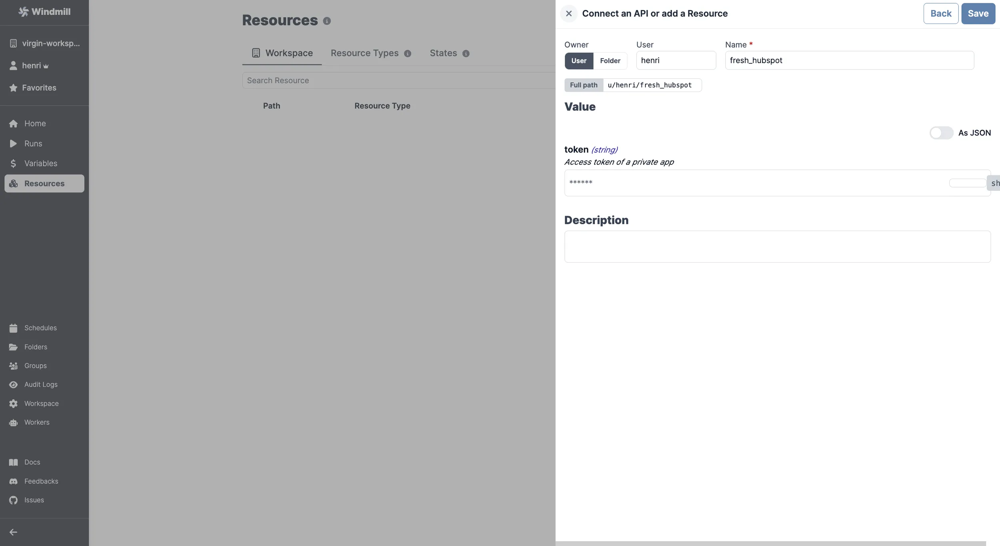

# HubSpot Integration

[HubSpot](https://www.hubspot.com/) is an inbound marketing, sales, and customer service platform.

To integrate HubSpot to Windmill, you need to save the following elements as a [resource](../core_concepts/3_resources_and_types/index.mdx).

| Property | Type   | Description                   | Default | Required | Where to Find                                                          |
| -------- | ------ | ----------------------------- | ------- | -------- | ---------------------------------------------------------------------- |
| token    | string | Access token of a private app |         | false    | HubSpot > Settings > Integrations > API key > Create private app token |

  

Your resource can be used [passed as parameters](../core_concepts/3_resources_and_types/index.mdx#passing-resources-as-parameters-to-scripts-preferred) or [directly fetched](../core_concepts/3_resources_and_types/index.mdx#fetching-them-from-within-a-script-by-using-the-wmill-client-in-the-respective-language) within [scripts](../script_editor/index.mdx), [flows](../flows/1_flow_editor.mdx) and [apps](../apps/0_app_editor/index.mdx).

<video
	className="border-2 rounded-xl object-cover w-full h-full dark:border-gray-800"
	controls
	src="/videos/add_resources_variables.mp4"
/>

 

:::tip

Find some pre-set interactions with HubSpot on the [Hub](https://hub.windmill.dev/integrations/hubspot).

Feel free to create your own HubSpot scripts on [Windmill](../getting_started/00_how_to_use_windmill/index.mdx).

:::
